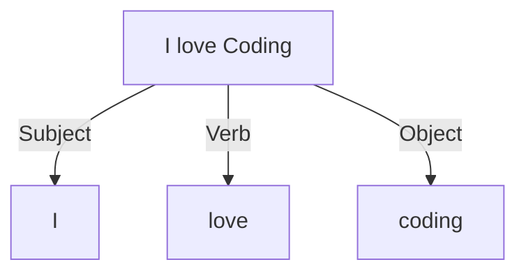

---
# You can also start simply with 'default'
theme: default
# random image from a curated Unsplash collection by Anthony
# like them? see https://unsplash.com/collections/94734566/slidev
background: /background.png
# some information about your slides (markdown enabled)
title: Abstract Syntax Tree (AST) & Typescript Compiler API
info: |
  If you want to write custom eslint rules, babel plugins, or other code parsers, you need to use Abstract Syntax Trees (AST). But they are generally scary for developers due to their complexity. In this talk, we will go through a real situation to parse some typescript React code using an AST and the Typescript Compiler API.
drawings:
  persist: false
# slide transition: https://sli.dev/guide/animations.html#slide-transitions
transition: slide-left
# enable MDC Syntax: https://sli.dev/features/mdc
mdc: true
layout: cover
image: /completion.png
backgroundSize: contain

# https://confoo.ca/en/2025/feedback/AABB2D7FC079843F2B4CD62C4898BA8A
# https://qrgenerator.org/transparent-qr/
---

<div class="-mt-20">

# Abstract Syntax Tree (AST) <br/> & Typescript API

## How I learned to stop worrying and love the AST

Thibault Friedrich --- February 26th, 2025

</div>

<div class="absolute right-20 bottom-20 text-center" v-mark="{ at: 1, color: 'orange', type: 'circle' }">

Feedback form
</div>

<!--
The last comment block of each slide will be treated as slide notes. It will be visible and editable in Presenter Mode along with the slide. [Read more in the docs](https://sli.dev/guide/syntax.html#notes)
-->

<style>

h1 {
  color: white;
}

h2 {
  color: #01a2ff;
  margin-top: 10px;
  font-weight: 500;
}
</style>

<!--
Today we will walk throught a real situation as a developer. This is not a theoretical talk but a practical one. We will see how to parse some typescript React code using an AST and the Typescript Compiler API. But I think the practice can be applied to other AST parsers. And I hope you will learn to love ASTs too.
-->

---
layout: image-right
image: /portrait.png
backgroundSize: cover

---

# About me: Thibault Friedrich

- Frontend developer for 10 years
- Using _React_ for 6+ years and love it
- Strong focus on Ux, Agile and Code craftsmanship  
  - ➡️ find my articles on [Medium](https://medium.com/@thibault-friedrich)
- Maintainer of [DesignSystemHub](https://design-system-hub.com)
  - Documentation for design systems
  - Storybook alternative
  - zero config
  - <span v-mark.highlight.orange>automatic detection</span> of React components

---

# Use case: [design-system-hub.com](https://design-system-hub.com)


<div class="absolute top-30 left-15 text-white h-40 w-30" v-mark="{ at: 1, color: 'orange', type: 'circle' }"></div>


<div class="absolute top-40 left-60 text-white h-30 w-50" v-mark="{ at: 2, color: 'orange', type: 'circle' }"></div>

<div class="absolute bottom-15 right-75 text-white h-40 w-110" v-mark="{ at: 3, color: 'orange', type: 'circle' }"></div>


<div class="absolute bottom-40 right-18 text-orange w-50 text-xl" >
  
  <div v-click="'1'">Need to find:</div>
  <ul>
      <li v-click>React components</li>
      <li v-click>JsDoc</li>
      <li v-click>Properties</li>
  </ul>
</div>

<style>
img {
  border-radius: 10px;
  border: 1px solid #333;
}
</style>

---

# How to detect a React component in the code?

```tsx
type Props = {
  children: React.ReactNode
  variant: 'primary' | 'black' | 'basic'
  onClick: () => void | Promise<void>
}

/**
 * @deprecated
 */
const ButtonLegacy = ({ children, variant, onClick }: Props) => {
  return <button onClick={onClick} className={style[variant]}>{children}</button>
}
```

<div v-click class="mt-10">

 **Long online search: You don't want to recreate a parser yourself.** <span v-click>➡️ Use an __AST__ parser. </span>

</div>
<div v-click>
  That's the moment you start to be scared and you think this project is too complex for you. 🤯😬
</div>


---

# What is an AST (Abstract Syntax Tree)?

<div v-click>

When you analyze a language like Javascript or English: 


<div class="text-center text-2xl">
"I love coding"
</div>

</div>


<div v-click>

1. __lexical__ analysis to detect the tokens: <kbd>I</kbd> <kbd>love</kbd> <kbd>coding</kbd>

</div>

<div v-click>

2. __syntactic__ analysis to understand the relationship between tokens

</div>


<div class="flex flex-row items-center justify-center">


<div class="flex flex-col items-center justify-center">
<div v-click>

<div v-mark="{ at: 5, type: 'circle', color: 'orange' }">



</div>
</div>


<div class="text-orange" v-click="'5'">This is an AST (Abstract Syntax Tree) </div>

</div>

<div v-click>

<div class="flex flex-row items-center justify-center ">

<div class="flex flex-col items-center justify-center">


</div>
</div>


</div>


</div>


<div class="absolute left-60px bottom-20px text-xs">

[Abstract Syntax Tree (AST) - Explained in Plain English](https://dev.to/balapriya/abstract-syntax-tree-ast-explained-in-plain-english-1h38)

</div>

---

# Good news: Typescript Compiler API

```ts
import ts from 'typescript'

const program = ts.createProgram(fileNames, tsConfig)
const checker = program.getTypeChecker()

return program
  .getSourceFiles()
  .filter(sourceFile => !sourceFile.isDeclarationFile)
  .flatMap(sourceFile => visitSourceFile(sourceFile, checker))
```


<div class="absolute left-60px bottom-20px text-xs">

[Using the Compiler API](https://github.com/Microsoft/TypeScript/wiki/Using-the-Compiler-API)

</div>

---
layout: center
---

# Demo time


---
layout: image-right
image: /completion.png
backgroundSize: contain

---

# Conclusion: AST

- don't be scared
- very powerful
- write unit tests to avoid regressions
- [AST Explorer](https://astexplorer.net/) is your friend
- try and retry
- other use cases: 
  - [eslint custom rules](https://eslint.org/docs/latest/extend/custom-rules)
  - babel plugins
- typescript Compiler API is very easy to master

---
layout: two-cols
---

# Stay in contact


- [https://github.com/friedrith/abstract-syntax-tree](https://github.com/friedrith/abstract-syntax-tree)
- [https://thibaultfriedrich.io](https://thibaultfriedrich.io)
- [https://design-system-hub.com](https://design-system-hub.com)


<div class="flex flex-row items-center mt-10 gap-4">
<a href="https://www.linkedin.com/in/thibault-friedrich/" style="border: 0;"></a>
<a href="https://github.com/friedrith" style="border: 0;"></a>
<a href="https://x.com/R_Thibault_Oliw" style="border: 0;"></a>
<a href="https://medium.com/@thibault-friedrich" style="border: 0;"></a>
</div>

::right::

<div class="text-center flex flex-col items-center">


Feedback form

</div>
