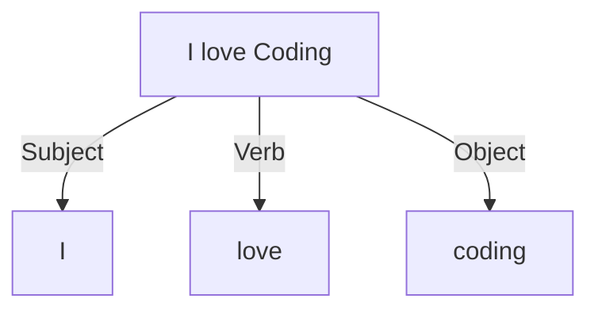

---
# You can also start simply with 'default'
theme: default
# random image from a curated Unsplash collection by Anthony
# like them? see https://unsplash.com/collections/94734566/slidev
background: /background.png
# some information about your slides (markdown enabled)
title: Abstract Syntax Tree (AST) & Typescript Compiler API
info: |
  ## Slidev Starter Template
  Presentation slides for developers.

  Learn more at [Sli.dev](https://sli.dev)
# apply unocss classes to the current slide
# https://sli.dev/features/drawing
drawings:
  persist: false
# slide transition: https://sli.dev/guide/animations.html#slide-transitions
transition: slide-left
# enable MDC Syntax: https://sli.dev/features/mdc
mdc: true
layout: cover
---

# Abstract Syntax Tree (AST) <br/> & Typescript API

## How I learned to stop worrying and love the AST

Thibault Friedrich --- September 19th, 2024

<!--
The last comment block of each slide will be treated as slide notes. It will be visible and editable in Presenter Mode along with the slide. [Read more in the docs](https://sli.dev/guide/syntax.html#notes)
-->

<style>

h1 {
  color: white;
}

h2 {
  color: #01a2ff;
  margin-top: 10px;
  font-weight: 500;
}
</style>

---

# About me: Thibault Friedrich

- Frontend developer for 10 years
- Using _React_ for 6+ years and love it
- Strong focus on Ux, Agile and Code craftsmanship 
  - ➡️ find my articles on Medium
- Indie hacker (looking for designer for collaboration)
- Maintainer of [DesignSystemHub](https://design-system-hub.com)
  - Document your design system easier and faster than storybook
  - <span v-mark.circle.orange>Automatic detection</span> of React components in your code

---

# What is an AST (Abstract Syntax Tree)?

When you analyze a language like Javascript or English: 


<div class="text-center text-2xl">
"I love coding"
</div>

<div v-click>

1. __lexical__ analysis to detect the tokens: <kbd>I</kbd> <kbd>love</kbd> <kbd>coding</kbd>

</div>
<div v-click>

2. __syntactic__ analysis to understand the relationship between tokens

<div class="flex flex-col items-center justify-center">



</div>


</div>


<div v-click>

<div class="flex flex-col items-center justify-center">
<strong class="pr-10">This is an AST (Abstract Syntax Tree) ⬆️</strong>


</div>


</div>


<div class="absolute left-60px bottom-20px text-xs">

[Abstract Syntax Tree (AST) - Explained in Plain English](https://dev.to/balapriya/abstract-syntax-tree-ast-explained-in-plain-english-1h38)

</div>

---

# Why do I need to know about AST?

Sometimes, you need to parse the source code:

- custom eslint rules
- babel plugins, typescript, etc
- detect React components in the code

__You don't want to recreate a parser yourself.__ <span v-click>➡️ Use a parser and its __AST.__ </span>

<div v-click>

[AST Explorer](https://astexplorer.net/) is a great tool to understand the AST of a language.

</div>

---

# Real example: [design-system-hub.com](https://design-system-hub.com)


<div class="absolute bottom-30 right-30 text-white w-40 text-xl" v-click>Need to find the React components in the code</div>

<style>
img {
  border-radius: 10px;
  border: 1px solid #333;
}

</style>

---

# Typescript Compiler API

```ts
import ts from 'typescript'

const program = ts.createProgram(fileNames, tsConfig)
const checker = program.getTypeChecker()

for (const sourceFile of program.getSourceFiles()) {
  if (!sourceFile.isDeclarationFile) {
    visit(sourceFile) // <- do something with the AST
  }
}
```


<div class="absolute left-60px bottom-20px text-xs">

[Using the Compiler API](https://github.com/Microsoft/TypeScript/wiki/Using-the-Compiler-API)

</div>

---
layout: center
---

# Demo time


---
layout: image-right
image: /completion.png
backgroundSize: contain

---

# Conclusion

- very powerful
- very light [documentation](https://github.com/Microsoft/TypeScript/wiki/Using-the-Compiler-API)
- try and retry
- use typescript for Intellisense
- write unit tests to improve the coverage and avoid regressions
- [AST Explorer](https://astexplorer.net/) is your friend but not always enough
- other example: [eslint custom rules](https://eslint.org/docs/latest/extend/custom-rules)

---
layout: two-cols
---

# Stay in contact


- [https://www.linkedin.com/in/thibault-friedrich/](https://www.linkedin.com/in/thibault-friedrich/)
- [https://github.com/friedrith](https://github.com/friedrith)
- [https://medium.com/@thibault-friedrich](https://medium.com/@thibault-friedrich)
- [thibault.friedrich@interaction-dynamics.io](mailto:thibault.friedrich@interaction-dynamics.io)
- [https://interaction-dynamics.io](https://interaction-dynamics.io)
- [https://design-system-hub.com](https://design-system-hub.com)


::right::

<div class="text-center flex flex-col items-center">


[Repository](https://github.com/friedrith/abstract-syntax-tree)

</div>